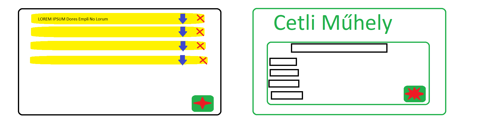
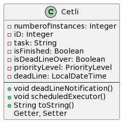
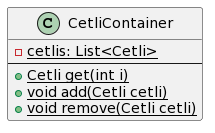
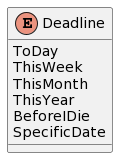
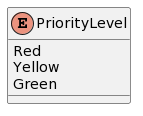
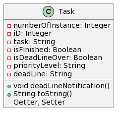
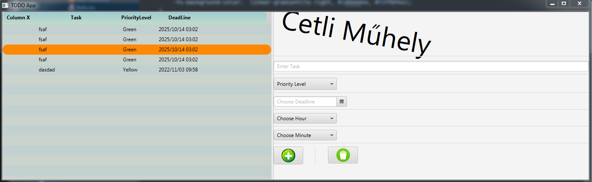

# ToDoApp JavaFX segítségével

## A projekt motivációja

* Meglévő ToDo applikációk gyakran nem rendelkeznek minden szükséges funkcióval, ha mégis, gyakran paywall mögött állnak
* Megesik, hogy egy-egy ToDo applikáció sokaknak már fölösleges, túlbonyolított verziója egy egyszerű koncepciónak, ami megeshet, hogy néhány felhasználónak fölösleges/zavaró is lehet
* Ezen hibákat kiküszöbölve elérhető lehet egy olyan alkalmazás lefejlesztése, ami 100%-osan kielégíti egy tág réteg igényeit

## A projekt célja (Milyen legyen az appunk?)

* Átlátható
* Egyszerű, de mégis tartalmaz mindent amire szükségünk lehet
* Felhasználóbarát, különösebb magyarázatra ne legyen szükség a használathoz
* Csak olyan feature-öket tartalmazzon, amit valóban ki tud használni a szoftver használója mindennapos szinten
* Könnyen hozzáférhető legyen, akár egy futtatható desktop file-ként, vagy később, továbbfejlesztés mobilappként/webappként

## Eszközök

* Java
* JavaFX
* InteliJ
* Maven
* JUnit
* Jacoco
* Paint
* Json
* PlantUML

## Üzleti logika

* ToDo cetli (taskok)
* Cetli hozzáadása
* törlése
* teljesítése
* határidők (beépítve nap, hét, mielőtt meghalok, de akár specifikus dátum is)
* prioritás (három beépített, szinekkel jelezve)

## UI

* Letisztult, átlátható felület
* Minimalista megközelítés, egyszerű grafikával
* Konzisztens megjelenítés, magától értetődő ikonok

## DB

* valami egyszerü (pl. Json)

## Mérföldkövek

* Üzleti logika müködik konzolon
* MVC architektúra alkalmazása
* logok
* magas tesztlefedettség, jól működő tesztek
* magas Javadoc dokumentáltság
* cleancode elvei teljesülnek
* csinos UI
* gombok
* checkBoxok
* Reszponzív
* Web alkalmazás
* skálázhatóság

## UI megközelítőleges, elképzelt kinézete

## Tervezett osztályok, függvényei

### Főosztály, ami tartalmazza a cetliket majd

### Maga a cetli, ami majd egy feladat leírását tartalmazza

### A Deadline enum, ami a Cetli egy részét alkotja

### A PriorityLevel enum, ami egy Cetli 3 prioritását állapítja meg

### A Task osztály, ami Cetli objektumokkal végez logikai ellenőrzéseket, feltételeket ellenőrzi

## Tesztek, tesztelhetőség

* A tesztek JUnit5-ban íródnak, és Jacoco-val lesz a tesztlefedettség ellenőrzive
* Alapvető célja a teszteknek, hogy jól megírt, valóban hasznos tesztek legyenek
* A tesztek ne legyenek olyanok, amik egyszerre sok funkcionalitást tesztelnek, legyenek külön-külön alkalmazottak
* A magas tesztlefedettség elérése a végcél

## Dokumentáltság

* A projekt elkészítése során elvárt feltétel, hogy a programkód jól dokumentált legyen
* A jól dokumentáltság kimerül ezen feltételekben:
* A függvények/osztályok jelentős része mellé tartozik egy Javadoc
* A Javadocok az elvárt formátumnak megfelelően vannak alkalmazva
* A projekt nem tartalmaz deprecated Javadocokat, mindig 100%-ig naprakész, hibáktól mentes

## Használati esetek

## Hogyan lehetne forgalomba hozni az alkalmazást?

## Vágyálomtervek

## Jelenlegi állapot

