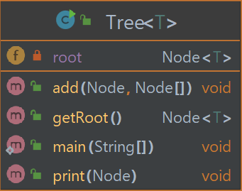

# ToDoApp JavaFX segítségével

## A projekt motivációja

* Meglévő ToDo applikációk gyakran nem rendelkeznek minden szükséges funkcióval, ha mégis, gyakran paywall mögött állnak
* Megesik, hogy egy-egy ToDo applikáció sokaknak már fölösleges, túlbonyolított verziója egy egyszerű koncepciónak, ami megeshet, hogy néhány felhasználónak fölösleges/zavaró is lehet
* Ezen hibákat kiküszöbölve elérhető lehet egy olyan alkalmazás lefejlesztése, ami 100%-osan kielégíti egy tág réteg igényeit

## A projekt célja (Milyen legyen az appunk?)

* Átlátható
* Egyszerű, de mégis tartalmaz mindent amire szükségünk lehet
* Felhasználóbarát, különösebb magyarázatra ne legyen szükség a használathoz
* Csak olyan feature-öket tartalmazzon, amit valóban ki tud használni a szoftver használója mindennapos szinten
* Könnyen hozzáférhető legyen, akár egy futtatható desktop file-ként, vagy később, továbbfejlesztés mobilappként/webappként

## Eszközök

* Java
* JavaFX
* BootstrapFX
* FXTrayIcon
* InteliJ
* Maven
* Intellij beépített UML készítője
* Paint
* PlantUML 
* Apache Derby
* Discord (kommunikáció)
* Github 

## Üzleti logika

* ToDo cetli (taskok)
* Cetli hozzáadása
* A cetlik tartalmazzanak "alcetliket" (subtaskok, fás szerkezet kialakítása)
* törlése (ha a teendő kész, vagy már nem aktuális)
* határidők (dátum formátumában)
* prioritás (három beépített, szines csillagokkal jelezve a UI-on)

## UI

* Letisztult, átlátható felület
* Minimalista megközelítés, egyszerű grafikával
* A megjelenített tartalom legyen nagyrészt általunk készített
* Ne tartalmazzon semmi fölösleges dolgot, ami megzavarhatja a usert
* Az alkalmazás működjön dinamikusan
* Konzisztens megjelenítés, magától értetődő ikonok

## DB

* Apache Derby használata 
    - Egyszerű setupolni
    - Alacsony footprint (2.6 MB)
    - Számunkra szükséges feladatok elvégzésére tökéletesen megfelel

## Mérföldkövek

* Üzleti logika müködik konzolon - kész
* MVC architektúra alkalmazása - kész
* magas Javadoc dokumentáltság - az applikáció inkább a beszédes kódra hagyatkozik, néhol hiányos a javadoc
* cleancode elvei teljesülnek - kész
* csinos UI - kész
* gombok - kész 
* checkBoxok - végül másképp valósult meg
* Reszponzív - nagyrészt megvalósult
* Web alkalmazás - vágyálomterv, következő nagy lépés lenne az applikáció továbbfejlesztése során
* skálázhatóság
* az applikáció widgetként 

# Elsődleges tervek

## UI megközelítőleges, elképzelt kinézete

## Tervezett osztályok, függvényei

### Főosztály, ami tartalmazza a cetliket majd

### Maga a cetli, ami majd egy feladat leírását tartalmazza

### A Deadline enum, ami a Cetli egy részét alkotja (végül nem került használatra)

### A PriorityLevel enum, ami egy Cetli 3 prioritását állapítja meg

### A Task osztály, ami Cetli objektumokkal végez logikai ellenőrzéseket, feltételeket ellenőrzi

## Tesztek, tesztelhetőség

* A tesztek JUnit5-ban íródnak, és Jacoco-val lesz a tesztlefedettség ellenőrzive
* Alapvető célja a teszteknek, hogy jól megírt, valóban hasznos tesztek legyenek
* A tesztek ne legyenek olyanok, amik egyszerre sok funkcionalitást tesztelnek, legyenek külön-külön alkalmazottak
* A magas tesztlefedettség elérése a végcél

* // A tesztek végül nem valósultak meg.

## Dokumentáltság

* A projekt elkészítése során elvárt feltétel, hogy a programkód jól dokumentált legyen
* A jól dokumentáltság kimerül ezen feltételekben:
* A kód beszédes, megfelelő dokumentáltság nélkül is triviális, hogy a kód hol, mit csinál.
* A függvények/osztályok jelentős része mellé tartozik egy Javadoc
* A Javadocok az elvárt formátumnak megfelelően vannak alkalmazva
* A projekt nem tartalmaz deprecated Javadocokat, mindig 100%-ig naprakész, hibáktól mentes

## Jelenlegi állapot

## Hogyan lehetne forgalomba hozni az alkalmazást?

Legegyszerűbb módja egy kezdetleges desktop alkalmazás lenne, mivel ez a változat már némi apró hibától eltekintve használatra készen áll. Ezt az appot eleinte ingyenesen a felhasználók számára lehetne bocsátani, így lenne egy userbase, aki tesztelhetné, észrevételeket adhatna, hogy hová tovább. Amint látnánk, hogy milyen visszajelzések vannak, az alapján továbbfejleszthetnénk az applikációt, majd készíthetnénk egy prémium változatot, amivel néhány újabb funkció is elérhető lenne. Mivel nem egy hatalmas alkalmazásról, hanem egy "quality of life" appról van szó, aminek célja a mindennapi teendők elvégzésének követése, ezért nem árulhatnánk egetrengető árakon. A cél az lenne, hogy minél széleskörűbben elterjedt legyen, és a prémium funkciók valóban megérjék azt az párszáz-párezer forintot, amit kérnénk érte. Ha webre is ki tudnánk a szoftvert helyezni, néhány funkció lehetne előfizetés alapú is, amit alacsonyabb áron nyújtanánk.

## Vágyálomtervek

Az applikáció asztali alkalmazásként már teljesen használhatóvá vált. Ami nagyobb energiabefektetést, és több új eszköz használatát is igényelné, viszont hatalmas mérföldkő/újítás lehetne az alkalmazásba, hogy egy webes applikációt készítsünk el, amin keresztül a felhasználók valamilyen cloud service által nyújott segítséggel, autentikációval a meglévő teendőiket bárhol el tudnák érni. A felhasználó desktopról szinkronizálhatná a feladatait cloudra, és vice-versa. Az alkalmazásba akár építhetnénk fizetős tartalmakat, amely tartalmazhatna customizációt, így mindenki kedvére alakíthatná az alkalmazás felületét/színeit, hogy a számára legmegfelelőbb legyen az alkalmazás.

## Az applikáció végleges kinézete

### Az app main felülete, ahol megjelennek a taskok

### Ezt látjuk egy task lenyitásakor

### Itt adhatunk hozzá újabb cetliket

### Egy todo notification

### Az appunk így jelenik meg az asztalon widgetként

## Az applikáció végleges osztályai

### Segédosztály, ami segít elérni az applikáció widgetté alakítását

### A cetliket eltárolni segítő osztály

### A Cetlivel végezhető műveletek

### A Cetli osztály változói

### A CetliMűhely osztály felületéért felelős osztály

### Az applikációnk

### Az elsődleges screen felületéért felelős osztály

### Enum osztály, mely a prioritásokat tartalmazza

### Segédosztály, amely az ablak újraméretezésében segít

### Egy-egy ToDo Cetlivel elvégezhető műveletekért felelős osztály

### Az alkalmazásban kialakított fás szerkezetének alapját adó osztály

